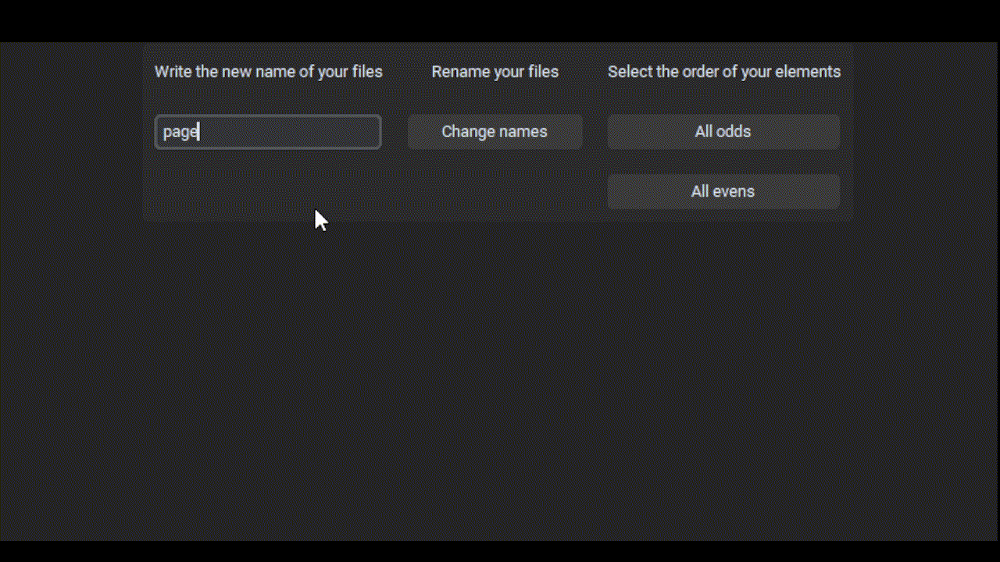
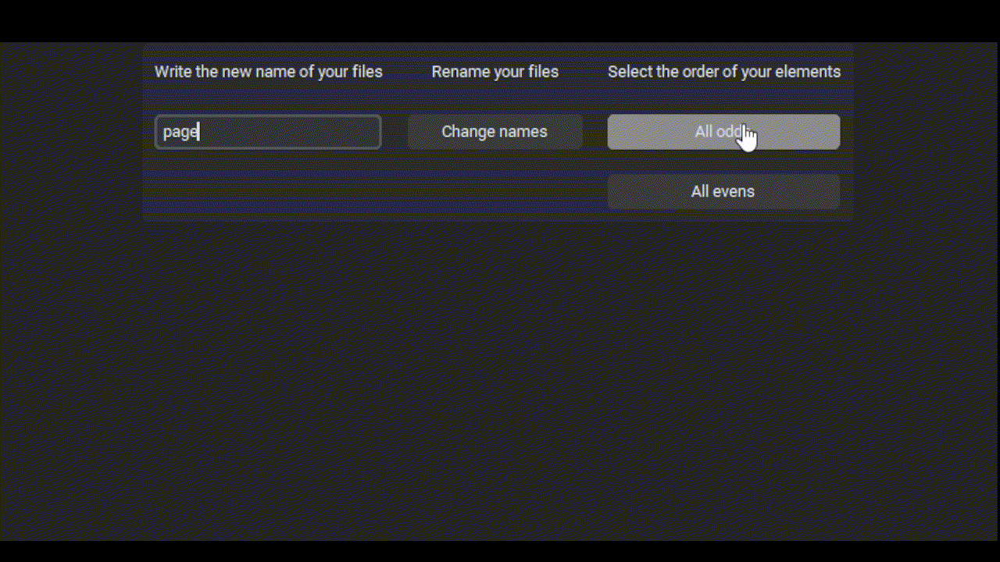
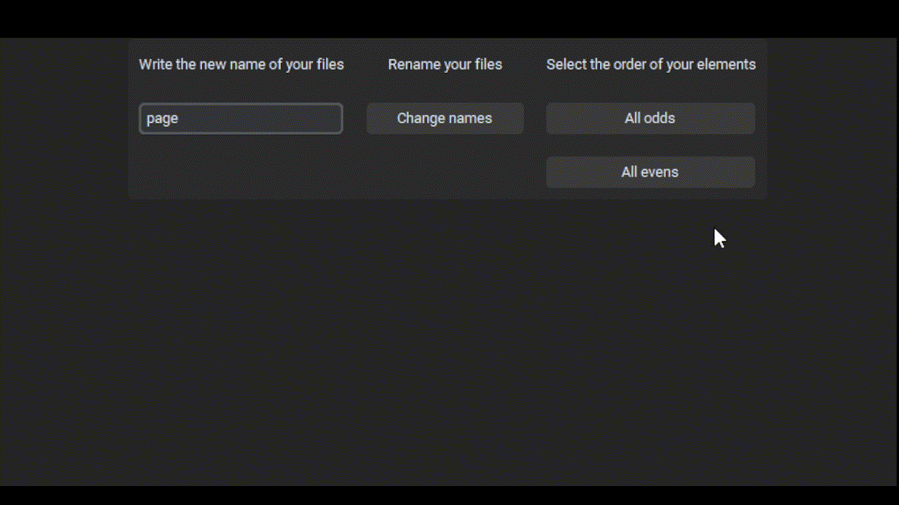

>## Automatization
<!-- Image Cover -->
<p align="center">
 
</p>
<!-- HeadLine -->

# Rename files

<!-- Dropline -->
## A plugin that helps you to order comic pages (an other kind of project) in a numerical disposition with only one click. This script also order the files in odder or evens. 

<!-- Index -->
## Index
[How to use the app](#functions) <br/>
[How to install app](#how-to-install-app) <br/>
[Issues](#issues) <br/>

## Usage 
| | |
|:---:| :---: |
|   |  |
| Write your name for all pages |  Select in "change names" to select the folder |
|  |   |
| Select the folder where is the files which you want to rename | Your files are renamed |

## Functions
| | |
|:---:| :---: |
|   |  |
| **Odds:** The number's files is renamed only in odds numbers |  **Evens:** The number's files is renamed only in evens numbers |


<!-- Instructions -->
## How to install app
You can download this plugin with the folowing command:
```
git clone 
```

To use this plugin only you need to open the file .exe into the folder "dist".


## Issues


## About the author 


