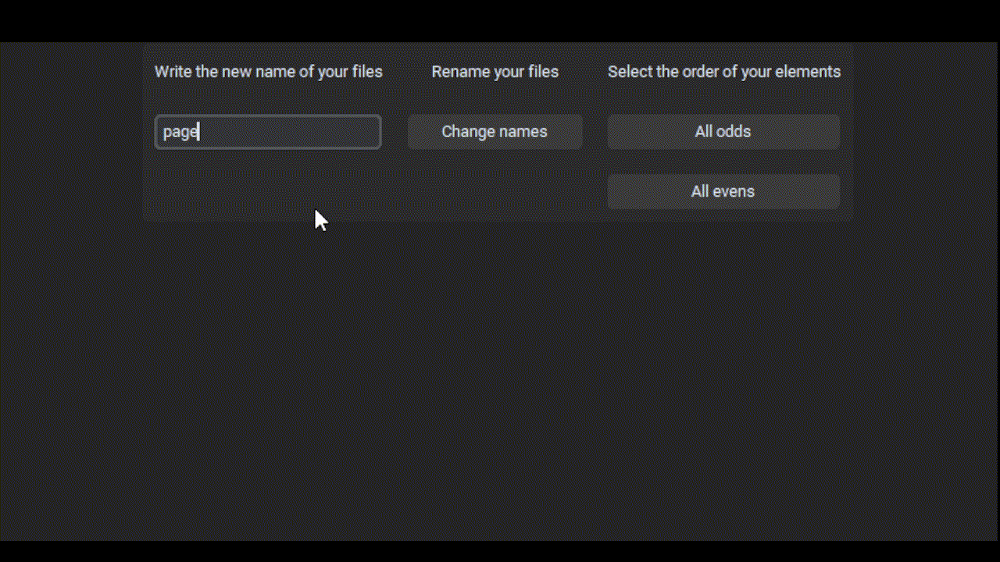
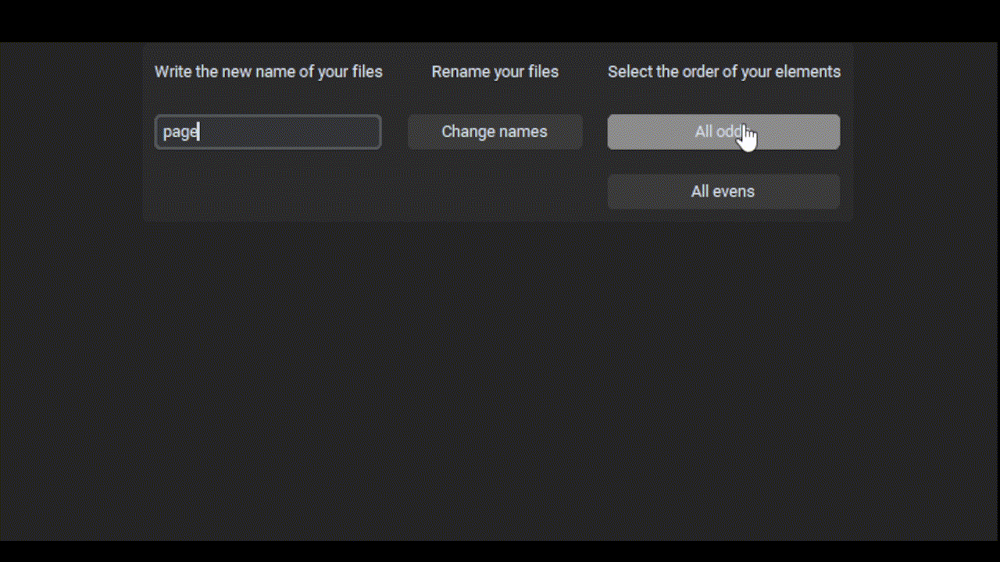
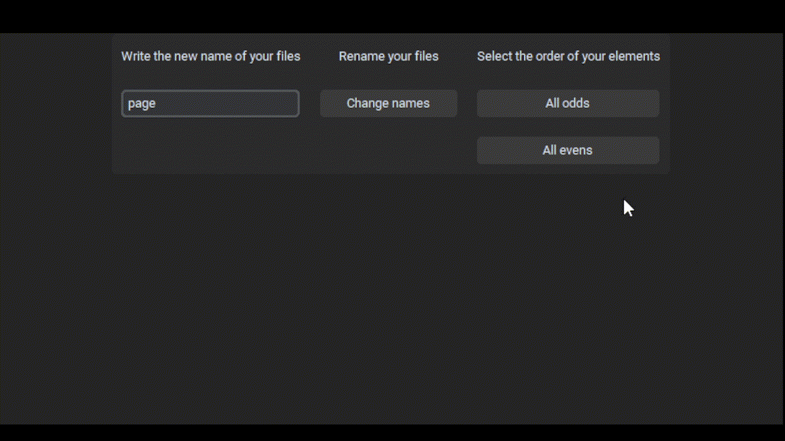

>[!CAUTION]
> Este proyecto está en proceso de desarrollo, por favor ten cuidado al utilizarlo.

>## Automatización
<!-- Image Cover -->
<p align="center">
 
</p>
<!-- HeadLine -->

# Renombrar archivos

Este es un ejecutable autónomo (*standalone*) diseñado para renombrar de forma masiva cualquier tipo de archivo en un orden numérico secuencial, sin importar su formato original. Es ideal para organizar páginas de cómics, mangas o colecciones de imágenes.

## Funciones
| | |
|:---:| :---: |
|   |  |
| Escribe el nombre para todas las páginas |  Haz clic en "change names" para seleccionar la carpeta |
|  |   |
| Selecciona la carpeta donde están los archivos que quieres renombrar | Tus archivos han sido renombrados |
|   |  |
| **Impares (Odds):** Los archivos se renombran solo con números impares |  **Pares (Evens):** Los archivos se renombran solo con números pares |

### Cómo usarlo
1. Ve al directorio `dist` y haz clic en el archivo `.exe`.
2. Ejecuta la aplicación.
3. Selecciona tu modo de ordenamiento preferido (Secuencial, Par o Impair).
4. Selecciona la carpeta donde deseas cambiar el nombre de tus archivos.
5. ¡Listo! Tus archivos se renombrarán instantáneamente.

## Cómo instalar el complemento
Puedes descargar este complemento con el siguiente comando:
```bash
  git clone https://github.com/jartibledev/order-comic-pages.git
```
o descargando el archivo ZIP.

## Problemas conocidos
>[!WARNING]
> No utilices este complemento en directorios raíz como el Escritorio o la carpeta de Usuarios. Úsalo solo en carpetas que hayas creado específicamente para tus proyectos.

## Sobre el autor 
Si quieres saber más sobre mí, echa un vistazo a mi [perfil](https://github.com/jartibledev).
